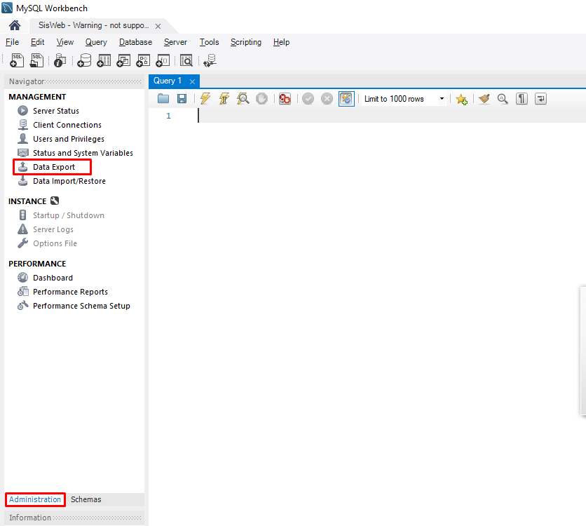
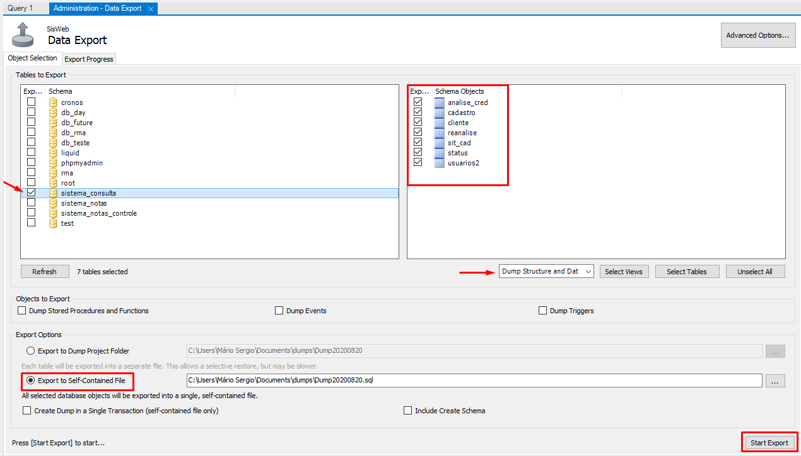

# Vivendo e aprendendo: Import/Export MySQL Workbench 8.0 

* Mário Sergio Ribeiro Nunes ([mariosergio3108@gmail.com](mailto:mariosergio3108@gmail.com))

Este documento foi criado para auxiliar iniciantes em banco de dados que utilizam MySQL Workbench como ferramenta visual, integrado para o sistema de banco de dados MySQL. 

## Exportando o banco do servidor remoto para o local

Para realizar a exportação do banco para a sua máquina local, você deverá acessar na barra de navegação a aba 'Administration' e clicar na opção 'Data Export'.

Ao clicar nesta opção, será aberta uma nova aba 'Administration - Data Export', nela você irá selecionar o banco desejado, e as tabelas que serão exportadas.

Caso você queira exportar todo o banco de dados em um único arquivo, basta selecionar a opção ‘Export to Self-Contained File’ nas opções de exportação (Export Options) e selecionar o caminho para despejo do arquivo.
Se o interesse da exportação seja apenas algumas tabelas, o ideal é que seja realizada pela opção ‘Export to Dump Project Folder’

### A opção ‘Dump Structure and Data’ é importante para salvar a estrutura da tabela e as linhas de dados nela

Com tudo pronto, podemos iniciar a Exportação em 'Start Export'.

Se no fim da exportação, apresentar o seguinte erro: “Unknown table 'column-statistics' in information_schema (1109)”, você deverá alterar uma configuração dentro do arquivo my.ini
O seguinte comando deverá ser inserido dentro deste arquivo.
Encontre os colchetes [mysqldump] e insira o comando, ‘column-statistics=0’
Caso esteja utilizando o Xampp v3.2.4, você poderá alterar o arquivo my.ini, localizado no caminho C:\xampp\mysql\bin\my.ini, porém, para que o Workbench possa identificar este arquivo, o caminho do mesmo deverá ser definido em Edit > Preference > Administration > Path to mysqldump tool.

## Importando os dados e a estrutura para dentro do seu banco

Para a realização da importação do banco de dados, você deverá acessar na barra de navegação a aba 'Administration' e clicar na opção 'Data Import/Restore'.

